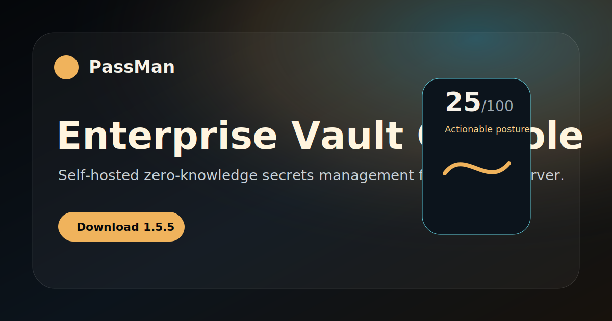

<p align="center">
  
</p>

<h1 align="center">PassMan Enterprise Vault Console</h1>

<p align="center">
  <strong>Self-hosted, zero-knowledge secrets vault for Windows Server operations.</strong>
</p>

<p align="center">
  <a href="https://github.com/ucsahinn/passman-releases/releases/latest"><strong>Latest Release</strong></a>
  ·
  <a href="docs/README.md"><strong>Documentation</strong></a>
  ·
  <a href="kb/README.md"><strong>Knowledge Base</strong></a>
  ·
  <a href="SECURITY.md"><strong>Security</strong></a>
  ·
  <a href="SUPPORT.md"><strong>Support</strong></a>
</p>

<p align="center">
  <code>Current stable: 1.5.3</code>
  &nbsp;
  <code>Server: Windows MSI</code>
  &nbsp;
  <code>Docs: TR + EN</code>
  &nbsp;
  <code>Source: private</code>
</p>

---

## What This Repository Is

This is the public release, documentation and support repository for PassMan. It is designed to be read directly on GitHub by administrators, security operators and licensed customers.

The product source code, signing workflow, license issuer material and private build history remain private. This repository contains only customer-safe documentation, release notes, diagrams and links to GitHub Release assets.

## Current Stable Release

| Asset | Purpose |
| --- | --- |
| [PassMan-1.5.3-x64.msi](https://github.com/ucsahinn/passman-releases/releases/latest/download/PassMan-1.5.3-x64.msi) | Installs or upgrades PassMan Server on Windows. |
| [passman-update.json](https://github.com/ucsahinn/passman-releases/releases/latest/download/passman-update.json) | Signed update manifest verified by PassMan. |
| [passman-chromium-extension.zip](https://github.com/ucsahinn/passman-releases/releases/latest/download/passman-chromium-extension.zip) | Browser extension fallback package. |
| [passman-share-decrypter.zip](https://github.com/ucsahinn/passman-releases/releases/latest/download/passman-share-decrypter.zip) | Offline external-share opening tool. |
| [passman-ad-agent.ps1](https://github.com/ucsahinn/passman-releases/releases/latest/download/passman-ad-agent.ps1) | PassMan DC Agent Service installer script. |

> Installers, ZIP packages, PowerShell scripts and signed manifests are published through GitHub Releases. They are not stored in the git tree.

## Component Matrix

| Component | Version | Delivery | Operator Outcome |
| --- | ---: | --- | --- |
| PassMan Enterprise Vault Console | 1.5.3 | Windows MSI | Self-hosted server runtime, vault console, users, audit, updates. |
| Chromium Browser Extension | 3.1.8 | Managed rollout or ZIP fallback | Autofill, save/update prompts, active-site record count. |
| Offline Share Decrypter | 1.2.0 | Release ZIP and MSI support component | Local-only external share opening with expiry and usage limits. |
| PassMan DC Agent Service | 1.0.10 | Release script and MSI support component | Active Directory sync through a Windows service. |

## Product Capabilities

| Area | Capability |
| --- | --- |
| Vault console | Passwords, API keys, credentials, secure notes, certificates and file-backed secrets. |
| Zero-knowledge model | Secret payloads are encrypted before persistence; unlock material stays in the active browser session. |
| Security posture | 2FA state, audit-chain state, extension health, license capacity and update status are surfaced as actions. |
| Sharing | Selected records and files can be packaged for internal or offline external sharing. |
| Browser extension | Pairing, autofill, save-login prompts, update-login prompts and active-site badge counts. |
| Directory integration | PassMan DC Agent Service syncs AD scope using redacted service logs and local credential capture. |
| Operations | Offline licensing, encrypted backups, diagnostics, signed updates and support-safe troubleshooting paths. |

## Recommended Operator Path

1. Install the Windows Server MSI.
2. Open PassMan through the server IP or DNS name.
3. Create the owner profile and apply the license.
4. Configure public host and HTTPS before wider access.
5. Enable 2FA and verify the audit chain state.
6. Pair the Chromium extension for approved browsers.
7. Configure Active Directory sync if needed.
8. Review backup, restore and update procedures.

## Documentation

| Guide | Turkish | English |
| --- | --- | --- |
| Overview | [TR](docs/tr/overview.md) | [EN](docs/en/overview.md) |
| Windows Server installation | [TR](docs/tr/install-windows-server.md) | [EN](docs/en/install-windows-server.md) |
| First run, owner and license | [TR](docs/tr/first-run-owner-license.md) | [EN](docs/en/first-run-owner-license.md) |
| Public host and HTTPS | [TR](docs/tr/public-host-https-certificate.md) | [EN](docs/en/public-host-https-certificate.md) |
| Update Center | [TR](docs/tr/update-center.md) | [EN](docs/en/update-center.md) |
| Browser extension | [TR](docs/tr/browser-extension.md) | [EN](docs/en/browser-extension.md) |
| Active Directory agent | [TR](docs/tr/active-directory-agent.md) | [EN](docs/en/active-directory-agent.md) |
| Sharing and offline decrypter | [TR](docs/tr/sharing-and-offline-decrypter.md) | [EN](docs/en/sharing-and-offline-decrypter.md) |
| Backups and restore | [TR](docs/tr/backups-and-restore.md) | [EN](docs/en/backups-and-restore.md) |
| Audit and security posture | [TR](docs/tr/audit-and-security-posture.md) | [EN](docs/en/audit-and-security-posture.md) |
| Troubleshooting | [TR](docs/tr/troubleshooting.md) | [EN](docs/en/troubleshooting.md) |
| FAQ | [TR](docs/tr/faq.md) | [EN](docs/en/faq.md) |

## Knowledge Base

| Incident Path | English | Turkish |
| --- | --- | --- |
| MSI installation fails | [EN](kb/en/msi-installation-fails.md) | [TR](kb/tr/msi-installation-fails.md) |
| Update stays around 76 percent | [EN](kb/en/update-stuck-76.md) | [TR](kb/tr/update-stuck-76.md) |
| DC Agent service cannot connect | [EN](kb/en/dc-agent-service.md) | [TR](kb/tr/dc-agent-service.md) |
| Extension pairing remains pending | [EN](kb/en/extension-pairing.md) | [TR](kb/tr/extension-pairing.md) |
| Certificate warning | [EN](kb/en/certificate-warning.md) | [TR](kb/tr/certificate-warning.md) |
| Audit chain is partial | [EN](kb/en/audit-chain-partial.md) | [TR](kb/tr/audit-chain-partial.md) |
| License is read-only | [EN](kb/en/license-read-only.md) | [TR](kb/tr/license-read-only.md) |
| External share package fails | [EN](kb/en/external-share-fails.md) | [TR](kb/tr/external-share-fails.md) |

## Screenshots And Diagrams

| Visual | What It Shows |
| --- | --- |
|  | Security posture, risk actions and vault overview. |
|  | Active-site badge count, autofill and save/update prompts. |
|  | OU, group and user scope selection for directory sync. |
|  | Browser-side unlock and encrypted persistence boundary. |
|  | Signed manifest, SHA-256 and signer-thumbprint verification. |
|  | Selected-record sharing, expiry, usage limits and local opening. |

## Update Trust Model

PassMan-managed updates verify the signed update manifest, release asset metadata, SHA-256 checksums and MSI signer thumbprint before exposing an update in the console.

A local PassMan-managed release signer can be accepted by PassMan when the signed manifest pins that signer. A CA-backed or trusted-signing certificate is still recommended for Windows reputation and broad OS-level trust.

## Public Safety Boundary

Never upload or paste these materials into this repository, public issues, comments or support threads:

- Plaintext secrets, passwords, share passphrases or vault contents.
- AD bind passwords, agent tokens, license private keys or update signing private keys.
- Databases, backups, logs with sensitive values, PFX/P12 files or private keys.
- Screenshots showing real secret records, users, customer URLs or internal infrastructure.

Use placeholders such as `<PASSMAN_URL>`, `<SERVER_HOST>`, `<AGENT_ID>`, `<AGENT_TOKEN>` and `<LICENSE_CODE>` in public examples.

## Release Notes

Full release notes are maintained in [RELEASES.md](RELEASES.md). Older public downloads may be retired after their notes are consolidated there. Use the latest release for new installations and updates.

## Repository Validation

Run before publishing public documentation changes:

```powershell
npm run validate
```

The validation checks local links, TR/EN doc parity, required visual assets, stale latest-version wording, forbidden public-site leftovers and secret-like patterns.
